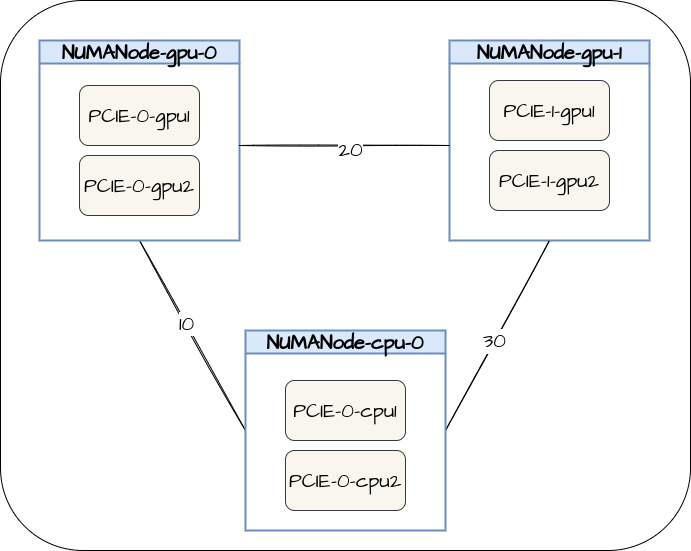

# Introduction
This document provides API specification of NodeResourceTopology API (aka NRT API)
which is a CRD based API that describes the structure of topology on a node. One of
the goals when designing this API was to ensure hardware independent data structure,
which allows us to have a future-proof API that represents hardware of varying internal
topology.

CRD instances must be created external to kubelet and independently. Each instance
will be bound to one working node.

It is worth noting that there are multiple legitimate ways of representing topology of
the same hardware.

As an example, the list of zones of the harware below can be represented in the following ways via the API:



```
{
	{Name=NUMANode-gpu-0,Type=NUMA, cost={{NUMANode-cpu-0:10},{NUMANode-gpu-1:20}},
	{Name=PCIE-0-gpu1, type=gpu, parent=NUMANode-gpu-0},
	{Name=PCIE-0-gpu2, type=gpu, parent=NUMANode-gpu-0},
	{Name=NUMANode-cpu-0,Type=NUMA, cost={{NUMANode-gpu-0:10},{NUMANode-gpu-1:30}},
	{Name=PCIE-0-cpu1, type=cpu, parent=NUMANode-cpu-0},
	{Name=PCIE-0-cpu2, type=cpu, parent=NUMANode-cpu-0},
	{Name=NUMANode-gpu-1,Type=NUMA, cost={{NUMANode-cpu-0:30},{NUMANode-gpu-0:20}},
	{Name=PCIE-1-gpu1, type=gpu, parent=NUMANode-gpu-1},
	{Name=PCIE-1-gpu2, type=gpu, parent=NUMANode-gpu-1},
}
```

```
{
	{Name=NUMANode-gpu,Type=Resource, cost=({NUMANode-cpu:20}}},
	{Name=PCIE-0-gpu1, type=gpu, parent=NUMANode-gpu},
	{Name=PCIE-0-gpu2, type=gpu, parent=NUMANode-gpu},
	{Name=PCIE-1-gpu1, type=gpu, parent=NUMANode-gpu},
	{Name=PCIE-1-gpu2, type=gpu, parent=NUMANode-gpu},
	{Name=NUMANode-cpu,Type=Resource, cost=({NUMANode-gpu:20}},
	{Name=PCIE-0-cpu1, type=cpu, parent=NUMANode-cpu},
	{Name=PCIE-0-cpu2, type=cpu, parent=NUMANode-cpu},
}
```

# NodeTopology Object Definition

```
// NodeResourceTopology describes node resources and their topology.
type NodeResourceTopology struct {
	metav1.TypeMeta   `json:",inline"`
	metav1.ObjectMeta `json:"metadata,omitempty"`

	Zones      ZoneList      `json:"zones"`
	Attributes AttributeList `json:"attributes,omitempty"`
}

// Zone represents a resource topology zone, e.g. socket, node, die or core.
type Zone struct {
	Name       string           `json:"name" protobuf:"bytes,1,opt,name=name"`
	Type       string           `json:"type" protobuf:"bytes,2,opt,name=type"`
	Parent     string           `json:"parent,omitempty" protobuf:"bytes,3,opt,name=parent"`
	Costs      CostList         `json:"costs,omitempty" protobuf:"bytes,4,rep,name=costs"`
	Attributes AttributeList    `json:"attributes,omitempty" protobuf:"bytes,5,rep,name=attributes"`
	Resources  ResourceInfoList `json:"resources,omitempty" protobuf:"bytes,6,rep,name=resources"`
}

// ZoneList contains an array of Zone objects.
type ZoneList []Zone

// ResourceInfo contains information about one resource type.
type ResourceInfo struct {
	// Name of the resource.
	Name string `json:"name" protobuf:"bytes,1,opt,name=name"`
	// Capacity of the resource, corresponding to capacity in node status, i.e.
	// total amount of this resource that the node has.
	Capacity resource.Quantity `json:"capacity" protobuf:"bytes,2,opt,name=capacity"`
	// Allocatable quantity of the resource, corresponding to allocatable in
	// node status, i.e. total amount of this resource available to be used by
	// pods.
	Allocatable resource.Quantity `json:"allocatable" protobuf:"bytes,3,opt,name=allocatable"`
	// Available is the amount of this resource currently available for new (to
	// be scheduled) pods, i.e. Allocatable minus the resources reserved by
	// currently running pods.
	Available resource.Quantity `json:"available" protobuf:"bytes,4,opt,name=available"`
}

// ResourceInfoList contains an array of ResourceInfo objects.
type ResourceInfoList []ResourceInfo

// CostInfo describes the cost (or distance) between two Zones.
type CostInfo struct {
	Name  string `json:"name" protobuf:"bytes,1,opt,name=name"`
	Value int64  `json:"value" protobuf:"varint,2,opt,name=value"`
}

// CostList contains an array of CostInfo objects.
type CostList []CostInfo

// AttributeInfo contains one attribute of a Zone.
type AttributeInfo struct {
	Name  string `json:"name" protobuf:"bytes,1,opt,name=name"`
	Value string `json:"value" protobuf:"bytes,2,opt,name=value"`
}

// AttributeList contains an array of AttributeInfo objects.
type AttributeList []AttributeInfo

// NodeResourceTopologyList is a list of NodeResourceTopology resources
type NodeResourceTopologyList struct {
	metav1.TypeMeta `json:",inline"`
	metav1.ListMeta `json:"metadata"`

	Items []NodeResourceTopology `json:"items"`
}
```

# Definitions of Keys

1. NodeResourceTopology.Zones - List of Zones. A zone can represent NUMA nodes, packages, dies, cores etc.
    1. Name - Name of a zone e.g numa-node-0, package-0
	1. Type - Type of a zone e.g. NUMANode, Package
    1. Parent - Parent of a zone. This is used to cross-reference a defined zone to establish a hierarchial structure between various zones. e.g. we can indicate that package-0 is parent of numa-node-0.
	1. Costs -  reports the distance in the machine topology between two zones. e.g. NUMA distances between various NUMA nodes. 
	1. Attributes - List of attributes corresponding to the zone
	1. Resources - Resource information is a measure of resources within that zone e.g. cpu, memory etc.
    This field also allows us to capture capacity, allocatable and available resources on a per-zone basis.

1. NodeResourceTopology.Attributes - can be used to indicate top level attributes of the NodeResourceTopology CR e.g. list of the policy name. The policy name could be one of the Node TopologyManager policy or other resource management component like CRI Resource Manager. These policies represent the behaviour of the scheduler plugin, this behaviour reflects the node based component for resource management.
